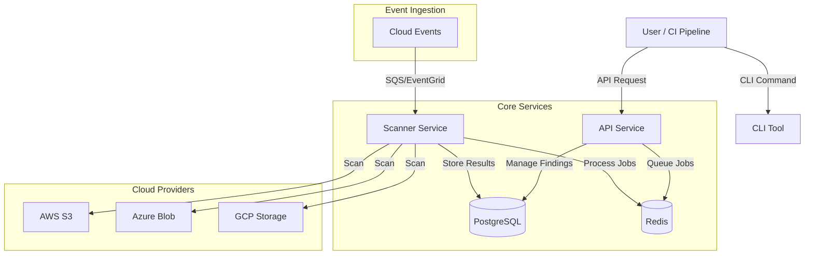

# 🛡️ StorageGuard

[](https://opensource.org/licenses/MIT)
[](https://github.com/yourusername/storageguard/actions)
[](https://www.typescriptlang.org/)
[](https://nestjs.com/)
[](https://www.docker.com/)

> **Secure your cloud storage infrastructure with intelligent, real-time scanning and IaC analysis.**

---

## 🚀 Overview

**StorageGuard** is a comprehensive security tool designed to detect misconfigurations, sensitive data exposure, and compliance violations across your cloud storage ecosystem. Whether youre deploying infrastructure via code or managing existing buckets, StorageGuard provides the visibility and control you need to stay secure.

Built with a modern microservices architecture, it supports **AWS**, **Azure**, and **GCP**, offering both real-time monitoring and static analysis for Infrastructure as Code (IaC) templates.

## ✨ Key Features

| Feature | Description |
| :--- | :--- |
| **☁️ Multi-Cloud Support** | Native scanning for AWS S3, Azure Blob Storage, and Google Cloud Storage. |
| **🔍 IaC Security Analysis** | Shift-left by scanning Terraform (`.tf`) and CloudFormation templates before deployment. |
| **⚡ Real-Time Monitoring** | Event-driven architecture using SQS/EventGrid/PubSub to detect changes instantly. |
| **🔐 Sensitivity Scanning** | Automatically identifying PII, credentials, and secrets within stored objects. |
| **📊 Dynamic Risk Scoring** | Prioritize remediation with intelligent risk scores based on exposure and data sensitivity. |
| **🧩 Modular Architecture** | Extensible design with separate API, Scanner, and Processing services. |

---

## 🏗️ Architecture

StorageGuard employs a microservices architecture to ensure scalability and resilience.



### Components

- **`apps/api`**: The central control plane. A NestJS application that handles user requests, manages findings, and orchestrates scans.
- **`apps/scanner`**: The workhorse. An independent service that executes scan jobs, connects to cloud providers, and performs deep analysis.
- **`apps/cli`**: A developer-friendly command-line interface for integrating StorageGuard into pipelines and local workflows.
- **`packages/database`**: Shared TypeORM data access layer.
- **`packages/shared`**: Common utilities and helper functions.

---

## 🛠️ Getting Started

### Prerequisites

- **Node.js** (v18+)
- **Docker & Docker Compose**
- **npm** (v9+)

### Installation

1.  **Clone the repository:**
    ```bash
    git clone https://github.com/MasterCaleb254/storageguard.git
    cd storageguard
    ```

2.  **Install dependencies:**
    ```bash
    npm install
    ```

3.  **Set up environment variables:**
    Copy the example `.env` file and configure your credentials.
    ```bash
    cp .env.example .env
    ```

4.  **Start the infrastructure:**
    Spin up PostgreSQL and Redis using Docker Compose.
    ```bash
    docker-compose up -d
    ```

5.  **Run database migrations:**
    ```bash
    npm run db:migrate
    ```

### Running Locally

Start the development servers for all services:

```bash
# Start API Service
npm run dev:api

# Start Scanner Service (in a separate terminal)
npm run dev:scanner
```

---

## 📖 Usage

### via CLI

Scan a Terraform directory for security issues:

```bash
# Install CLI globally (optional)
npm install -g @storageguard/cli

# Run a scan
storageguard scan --path ./infrastructure --type terraform
```

### via API

Submit a scan job programmatically:

```bash
curl -X POST http://localhost:3000/scans \
  -H "Content-Type: application/json" \
  -d '{
    "target": "s3://my-sensitive-bucket",
    "provider": "aws",
    "scanType": "deep"
  }'
```

---

## 🚦 Roadmap

- [x] Core Scanning Engine (AWS, Azure)
- [x] IaC Static Analysis
- [ ] GCP Support Complete
- [ ] Web Dashboard (Next.js)
- [ ] One-click Remediation
- [ ] Compliance Reporting (SOC2, HIPAA)

---

## 🤝 Contributing

We welcome contributions! Please see our [CONTRIBUTING.md](CONTRIBUTING.md) for details on how to submit pull requests, report issues, and suggest improvements.

1.  Fork the Project
2.  Create your Feature Branch (`git checkout -b feature/AmazingFeature`)
3.  Commit your Changes (`git commit -m 'Add some AmazingFeature'`)
4.  Push to the Branch (`git push origin feature/AmazingFeature`)
5.  Open a Pull Request

---

## 📄 License

Distributed under the MIT License. See `LICENSE` for more information.

---

<p align="center">
  Built with ❤️ 
</p>
